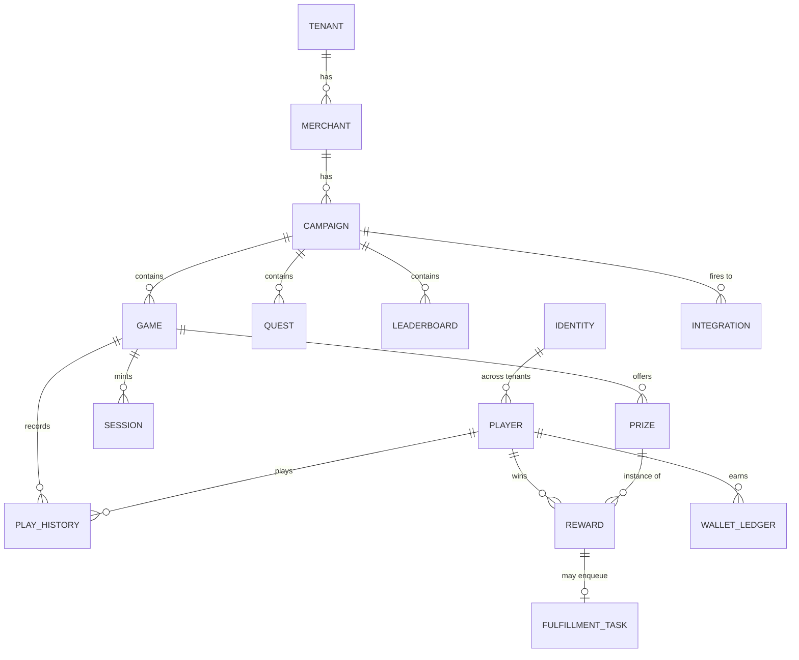

# Data model

The durable schema (Postgres or MySQL). Migrations live in
`adapters/sqlstore/migrations/{postgres,mysql}` and run with goose. Every table carries `tenant_id`
(campaign-scoped tables also `merchant_id`); JSON columns hold opaque, config-driven blobs the
engine reads but the schema doesn't constrain.

## Key tables

| Table | Purpose | Notable columns |
|---|---|---|
| `tenants` / `merchants` | Tenancy hierarchy | `settings.wallet_scope` |
| `identities` | Global person (internal) | `phone`, `email` — **each globally unique** |
| `players` | Tenant-scoped membership | `UNIQUE(tenant_id, identity_id)` |
| `games` | Config-driven game definition | `reward_handler`, `seed_generator`, `validator`, `handler_config`, `rules`, `ui` (opaque), `milestones`, `wallet_scope` |
| `prizes` | Stock + delivery policy | `remaining` (atomic deduct target), `fulfillment` (redemption mode + channel) |
| `sessions` | Single-use play session (durable audit; live copy in Redis) | `seed_data`, `expires_at` |
| `play_history` | Immutable audit of every play | `payload`, chosen `rewards`, `metadata`, `trace_id` |
| `rewards` | One awarded unit + lifecycle | `status`: `won → claimed → fulfilled → revoked`; `code` |
| `fulfillment_tasks` | Transactional outbox | `status`: `pending → processing → fulfilled / failed / dead` |
| `wallet_ledger` + balances | Points / lucky-item ledger | keyed by `(tenant_id, scope_key, currency)` |
| `integrations` | Outbound adapter registrations | `events[]`, `config`, `status` |

## Two principles encoded here

1. **Atomic stock, not locks.** Awarding a unit is
   `UPDATE prizes SET remaining = remaining - 1 WHERE id = ? AND remaining > 0` and a check of
   `RowsAffected == 1` — inside the same transaction as the turn-decrement, history insert, reward
   record, and (if needed) the fulfillment task. Works identically on Postgres and MySQL.
2. **Config over schema.** `handler_config`, `rules`, `ui`, `milestones`, and integration `config`
   are JSON. Adding a game shape or a UI feature changes the JSON, not the tables.

See **[Concepts → Generic engine](../concepts/generic-engine.md)** for what the config columns mean.
