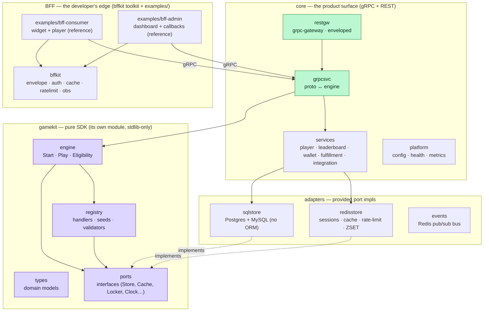
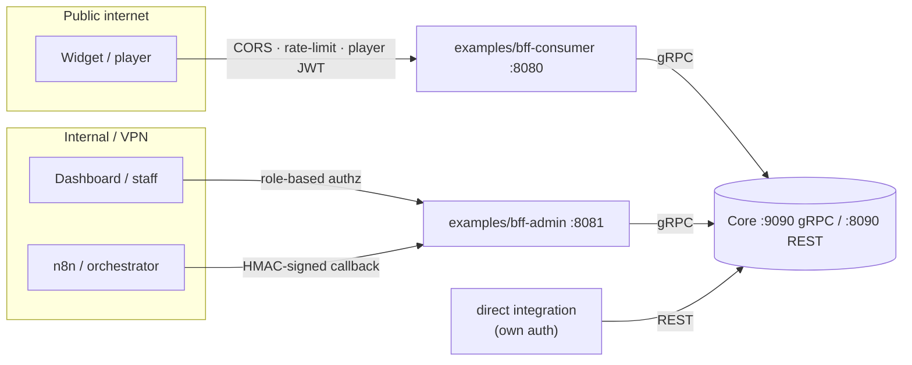
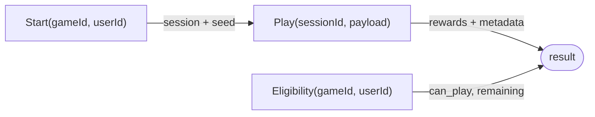

# Architecture overview

Muse is a Go monorepo (`go.work`) with a strict, one-directional dependency flow. Each layer only
knows about the layer beneath it.



## The layers

| Layer | Module(s) | Responsibility | Knows about… |
|---|---|---|---|
| **Pure SDK** | `gamekit` | Domain models + the generic engine + the handler/seed/validator registry. **No I/O.** | nothing but Go stdlib |
| **Adapters** | `adapters/sqlstore`, `adapters/redisstore`, `adapters/events` | Concrete implementations of the SDK's `ports` over SQL / Redis. | `gamekit/ports` |
| **Core** | `core` | The product surface. Wires `gamekit` + `adapters`, exposes the contract over **gRPC and REST** (grpc-gateway, enveloped), and hosts the services that need I/O (player auth, leaderboard, wallet, fulfillment, integration hub). **Auth-agnostic.** | gamekit + adapters + proto |
| **BFF** | `bffkit` (toolkit) + `examples/bff-consumer`, `examples/bff-admin` (reference) | The developer's edge, built on `bffkit`: auth, RBAC, caching, rate-limit, view-model assembly. **Not a shipped tier** — you build your own. | Core (via gRPC or REST) |

## Responsibility boundary: Core = business, BFF = presentation

This split is deliberate and load-bearing:

- **Core owns business objects & rules only.** It returns whole domain entities and business
  errors. The `ui` block on a game is an **opaque JSON blob** Core stores and returns but never
  interprets. Core does **not** authenticate — it trusts the caller to pass the tenant/merchant
  scope and only validates the business object. Core *does* now own the **transport-level**
  presentation its REST gateway needs: the envelope and the gRPC-status → HTTP mapping (shared via
  `pkg/envelope`), so a direct REST caller gets a first-class response without a BFF.
- **The BFF owns everything audience-facing.** It authenticates callers, enforces RBAC, aggregates
  multiple Core RPCs into one view model, shapes & redacts per audience (a public prize list strips
  `probability`/`stock`), caches hot reads, and rate-limits. This is **your** layer — `bffkit` is
  the toolkit, and `examples/` are runnable references to copy.

> **Consequence:** a new UI requirement is a BFF/widget change, not a Core change — reinforcing the
> config-driven goal. And because Core speaks REST directly, a simple integration can skip the BFF
> entirely and call `/api/v1` with its own auth in front.

## Why two reference BFFs?



The references split by audience to show the pattern: each can scale and be secured independently —
the admin surface never sits on the public edge. Both import the shared **`bffkit`** so behavior
(envelope, auth seam, error mapping) stays consistent. **You're free to structure your own BFF
differently** — one service, three, or none (call Core's REST directly behind your own gateway).

## The uniform response envelope

Every REST response — success or error — has the same shape:

```jsonc
{ "code": 0,            // canonical google.rpc.Code; 0 = OK
  "message": "ok",
  "trace_id": "01H…",   // also echoed in X-Trace-Id
  "data": { /* payload on success; null on error */ } }
```

Errors carry a stable machine-readable `reason` in `data.error` — see the
[Error reference](../reference/errors.md).

## The uniform engine API

Everything a game does goes through three operations, regardless of shape:



See **[Concepts → Generic engine](../concepts/generic-engine.md)** for how config selects the
behavior, and **[Flows → Gameplay](../flows/gameplay.md)** for the step-by-step sequence.
