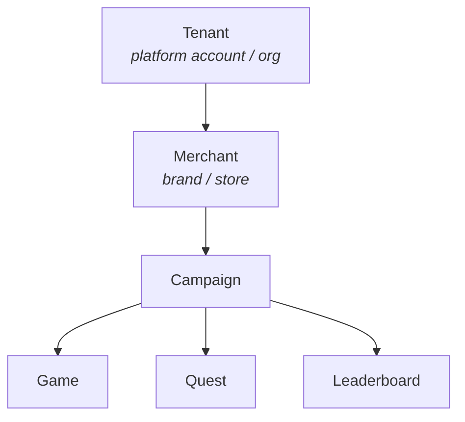
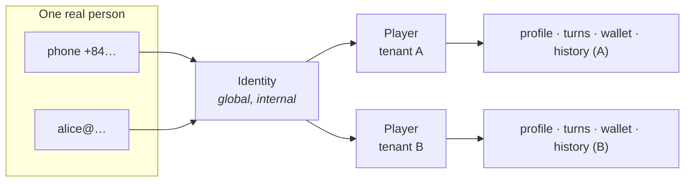
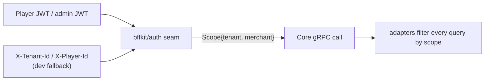

# Tenancy & identity

Muse is multi-tenant and multi-merchant, and the **same real person can play in many tenants
independently**. That requirement is modeled in three layers.

## The hierarchy

**Every persisted row carries `tenant_id`**; campaign-scoped rows also carry `merchant_id`. This is
the hard isolation + authorization boundary: the SDK takes a `Scope{tenant_id, merchant_id}` on
**every** call, and the adapters filter **every** query by it.

## Identity vs. player

- **Identity** (`identities`) — a real person, identified by **verified contacts**: `phone`
  (normalized E.164) and/or `email` (lowercased), **each globally unique**. A newly verified
  contact that already maps to an identity links to that same person (merge); otherwise it creates
  a new identity. Identity is **internal infrastructure** (platform-level dedup / anti-fraud) — it
  never exposes one tenant's data to another.
- **Player** (`players`, `UNIQUE(tenant_id, identity_id)`) — an identity *participating in a
  tenant*. Profile, collected fields, turn balances, wallet, and history hang off the **player**.

> **The headline guarantee:** same phone → **one** `identity_id` across tenants, but a **different,
> fully isolated** `player_id` per tenant.

## Authorization & scope

An admin JWT is scoped to a tenant (and optionally a merchant). A player JWT carries
`tenant_id` / `merchant_id?` / `player_id` / `identity_id` and is issued on login. The BFF auth
seam resolves the scope from the JWT (or, for dev/legacy callers, from `X-Tenant-Id` /
`X-Player-Id` headers) — handler code is identical either way.

## Configurable wallet scope

Turn balances and wallets are keyed by a configurable **`wallet_scope`** — `campaign` (default),
`merchant`, or `tenant` — set on tenant config and overridable per campaign. The same schema
supports one-off events (per-campaign) and brand-loyalty wallets (per-merchant/tenant) with no
change. See [Wallet & milestones](../concepts/wallet-milestones.md).

## Login methods

Login accepts **phone or email** via pluggable methods — `code` / `otp` / `magic_link` / `social`
(dev stubs now; real providers swap in behind the `Method` seam). Verification resolves-or-creates
the identity, upserts the tenant player, and issues the player JWT. See
[Flows → Player auth](../flows/player-auth.md).
