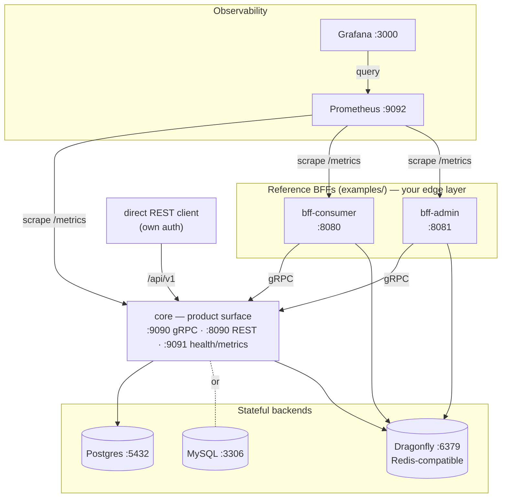
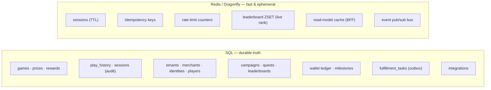

# Runtime topology

What actually runs when you `make up`. Everything is in `deploy/docker-compose.yml`.

## Services

| Service | Port(s) | Role |
|---|---|---|
| **core** | `9090` gRPC, `8090` REST, `9091` health+metrics | The product surface: engine + persistence + all hosting services, served over gRPC **and** REST (grpc-gateway, enveloped). The only thing that touches SQL. Auth-agnostic. |
| **bff-consumer** *(reference, `examples/`)* | `8080` | Public widget + player REST. CORS, per-player/IP rate limit, read-model cache. A reference for the public edge **you** build. |
| **bff-admin** *(reference, `examples/`)* | `8081` | Internal dashboard REST + the signed n8n callback. Role-based authz. A reference for the internal edge **you** build. |
| **postgres / mysql** | `5432` / `3306` | Durable system of record. Core targets **one** engine per deployment (`DB_ENGINE`); both are supported by the same raw SQL via a dialect layer. |
| **dragonfly** | `6379` | Redis-compatible: play sessions (TTL), idempotency keys, distributed rate-limit, leaderboard sorted sets, BFF read-model cache, and the event pub/sub bus. **Never** the source of truth for money/stock. |
| **prometheus** | `9092` | Scrapes `/metrics` from all three services; loads `alerts.yml`. |
| **grafana** | `3000` | Provisioned datasource + the "Muse — Overview" dashboard. |

## What lives where

**Rule of thumb:** anything involving money or stock is guarded by an atomic SQL conditional
update; Redis is cache + ephemeral state only. If Redis disappears, gameplay still works — caching
and rate-limiting simply degrade to no-ops.

## Health & readiness

- `GET /healthz` — liveness (always 200 if the process is up).
- `GET /readyz` — readiness; checks DB + Redis reachability (returns 503 with `X-Failed-Check`).
- `GET /metrics` — Prometheus exposition (see [Observability](../reference/observability.md)).
