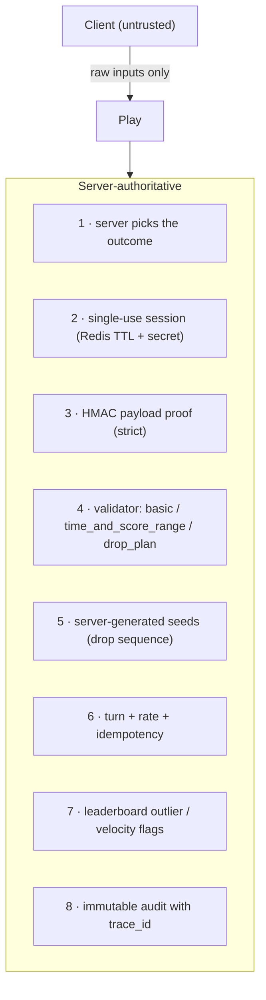

# Anti-cheat

Defense in depth. Each layer is independent; a game's `validator` + `anti_cheat` config picks how
strict to be (`none` | `basic` | `strict`) — so it stays config-driven.

1. **Server-authoritative outcomes** — the client never decides or sends the prize. For
   `probability` and `collect_items` the *server* picks the result; tampering the response is
   meaningless because the server already wrote it.
2. **Single-use sessions** — `Start` mints a session bound to `player_id`+`game_id`, stored in
   Redis with a TTL and an opaque secret. `Play` rejects unknown / expired / already-consumed
   sessions and marks the session consumed (one play per session).
3. **Signed payload proof (`strict`)** — `Start` returns a per-session HMAC secret; the client
   signs its payload (and, for action games, a compact replay `[{t, x}]`). `Play` verifies the
   HMAC and that the replay is internally consistent (event count == score, timestamps monotonic,
   spacing ≥ threshold). Blocks hand-crafted requests from DevTools.
4. **Validator registry** (per game):
   - `basic` — session + rules.
   - `time_and_score_range` — min/max play duration, theoretical score ceiling.
   - `drop_plan` — every claimed `drop_id` must exist in the server-generated sequence, respect
     `max_catchable`, and pass timing sanity. Unknown / duplicate / over-catch → `CHEAT_DETECTED`.
5. **Server-generated seeds** — for `collect_items`, the *server* generates the drop sequence in
   `Start` and stores it; `Play` validates caught ids against it. The client can't invent drops.
6. **Turn + rate enforcement** — eligibility (max plays per user/day, campaign window) checked
   inside the Play transaction; Redis token-bucket rate limits per player/IP; **idempotency keys**
   stop a winning `Play` from being replayed.
7. **Leaderboard anti-cheat** — score ceiling, statistical outlier (z-score), play-velocity, and
   multi-account detection move suspicious entries to a `flagged` state. `finalize` only awards
   un-flagged ranks; admins can `disqualify` / `adjust`.
8. **Audit & observability** — every play/claim/redeem writes immutable history with the inputs,
   chosen outcome, validator verdict, and `trace_id`.

:::info Adding a check
A new anti-cheat rule is a new `Validator` registered by name — the engine core is never touched.
:::
