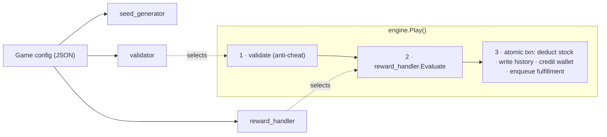
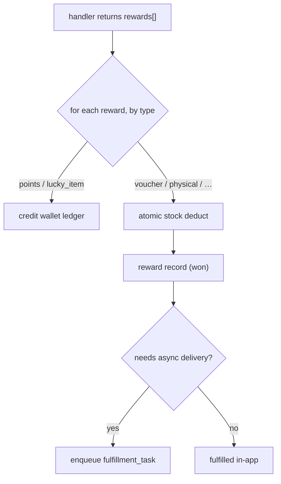

# The generic engine

The engine is the heart of Muse. It never changes per game. A game's behavior is selected entirely
by **config** that names three pluggable pieces:



## The three registries

Each is a string-keyed registry; adding a behavior = registering one implementation.

```go
type SeedGenerator interface { Generate(ctx, GameConfig, Session) (SeedData, error) }
type RewardHandler interface { Evaluate(ctx, GameConfig, SeedData, Payload) (RewardResult, error) }
type Validator     interface { Validate(ctx, GameConfig, Session, Payload) error }
```

| Registry | Built-ins | What it does |
|---|---|---|
| **seed_generator** | `none`, `drop_sequence`, `random_pick` | Produces per-session data at `Start` (e.g. the server-generated catch sequence). |
| **reward_handler** | `probability`, `score_to_tier`, `collect_items`, `lucky_item` | Decides the outcome at `Play`. |
| **validator** | `basic`, `time_and_score_range`, `drop_plan` | Anti-cheat checks before the handler runs. |

## Game shapes = combinations of the three

A "shape" is just a registered combination. Adding a game of an existing shape is **config only**.

| Shape | seed | handler | validator | Play payload |
|---|---|---|---|---|
| `spin_wheel` / `scratch_card` | `none` | `probability` | `basic` | `{}` |
| `egg_catcher` | `none` | `score_to_tier` | `time_and_score_range` | `{ "score": 75, "duration_ms": 8000 }` |
| `gift_catcher` | `drop_sequence` | `collect_items` | `drop_plan` | `{ "caught_items": ["d_3","d_6"] }` |
| collection game | `none` | `lucky_item` | `basic` | `{}` |

## The reward handlers

- **`probability`** — weighted random over the configured prizes (spin / scratch).
- **`score_to_tier`** — map `payload.score` → a tier → weighted random within that tier (egg-catcher).
- **`collect_items`** — verify `payload.caught_items` against the server's seed drop-plan, then
  aggregate per type (gift-catcher).
- **`lucky_item`** — award an intermediate **lucky item** into the player's wallet; milestones later
  convert accumulated items into real prizes (collection game).

## Uniform reward post-processing

A handler returns `rewards[]`, each with a `type`. The engine routes by type **inside the Play
transaction**:



So one play can yield **a prize + points together**, and points **accumulate across plays**. The
whole thing is one DB transaction — no partial awards.

## Why this matters

- A marketer ships a new spin wheel by POSTing a config — **zero backend code, zero deploy**.
- A developer adds a genuinely new mechanic by writing one handler/validator and registering it —
  **the engine core is untouched**.
- The same engine runs embedded (Mode A, in-memory fakes) or hosted (Mode B, SQL+Redis) — the logic
  is identical because it only depends on `ports`.
