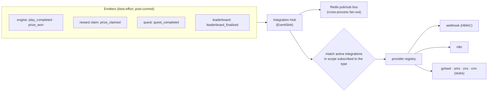

# Integration hub

Domain events fan out to **outbound integrations** so a campaign can push activity to a webhook, an
n8n flow, a Google Sheet, SMS/ZNS, or a CRM — configured, not coded.

## Events

Canonical, stable event types emitted across the system:

| Event | Emitted by |
|---|---|
| `play_completed` | engine (after every play commits) |
| `prize_won` | engine (per awarded prize) |
| `prize_claimed` | reward claim |
| `quest_completed` | quest completion |
| `leaderboard_finalized` | leaderboard finalize |

All emission is **best-effort** — an integration can never fail the play/claim that triggered it.

## The Hub

The Hub *is* the engine's `EventSink`. On each event it:

1. **publishes to the Redis pub/sub bus** for cross-process fan-out (extra Core replicas, the
   future realtime gateway, out-of-process consumers); and
2. looks up the **active integrations in the event's scope** that subscribe to that type
   (campaign-narrowed or scope-wide) and delivers through their **providers**.

Delivery failures are logged and skipped — never retried into the caller.

## Providers

A pluggable registry keyed by integration type (same pattern as reward handlers / fulfillment
channels):

| Type | Behavior |
|---|---|
| `webhook` | real HTTP `POST` of the event JSON, optional `X-Muse-Signature` HMAC-SHA256 |
| `n8n` | a webhook receiver (same POST + HMAC convention) |
| `gsheet`, `sms`, `zns`, `crm` | logging **stubs** — swap in a real impl by re-registering the type |

## Admin

| Endpoint | Purpose |
|---|---|
| `POST /api/v1/admin/integrations` | register an adapter (type, events, config) |
| `GET /api/v1/admin/integrations` | list |
| `DELETE /api/v1/admin/integrations/{id}` | remove |
| `POST /api/v1/admin/integrations/emit` | inject an event for testing → returns dispatch count |

All under role-based authz. See **[Flows → Integration events](../flows/integration-events.md)**.
