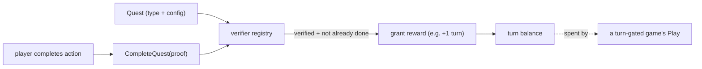
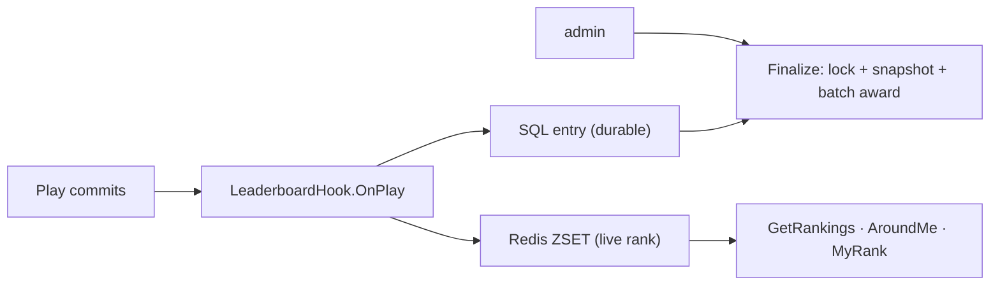

# Quests & leaderboard

Two engagement systems built on the same primitives.

## Quests / missions

A quest grants **play turns** (or another reward) when a player completes a verified action.

Quest types are a verifier registry (same pattern as reward handlers): `daily_checkin`,
`share_social`, `invite_friend`, `scan_qr`, `view_page`, `answer_question`, `external_event`.
Completion records gate re-completion — `daily_checkin` is one per day, others one per player.
Granted turns feed the engine's `Rules.UseTurns` gate, so "do a quest → earn a spin" works.

## Leaderboard ("Đua Top")

Durable entries live in SQL (the source of truth); a Redis **sorted set** mirrors them for O(log n)
real-time rank, around-me, and top-N.

- **Config** declares the metric, time window (fixed / recurring / manual), and prize tiers.
- **Update** is a post-Play hook — folding the play into every active board of the game's campaign,
  best-effort (a failure never fails the play).
- **Real-time reads** (`GetRankings`, `AroundMe`, `MyRank`) come off the Redis ZSET; the consumer
  BFF caches top-N with a short TTL.
- **Anti-cheat**: outlier/velocity checks flag suspicious entries; admins `disqualify` / `adjust`;
  `finalize` only awards un-flagged ranks, then snapshots and batch-awards the prize tiers.

See **[Flows → Leaderboard](../flows/leaderboard.md)** for the update-and-finalize sequence.
