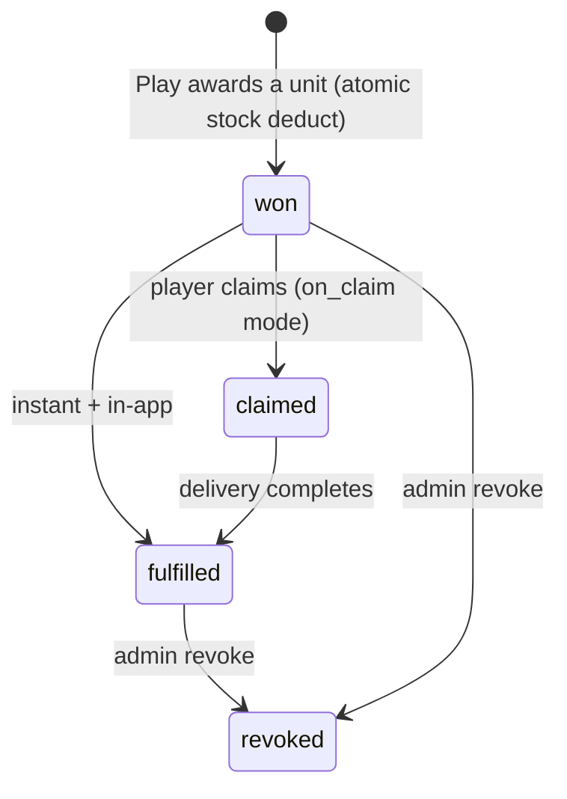
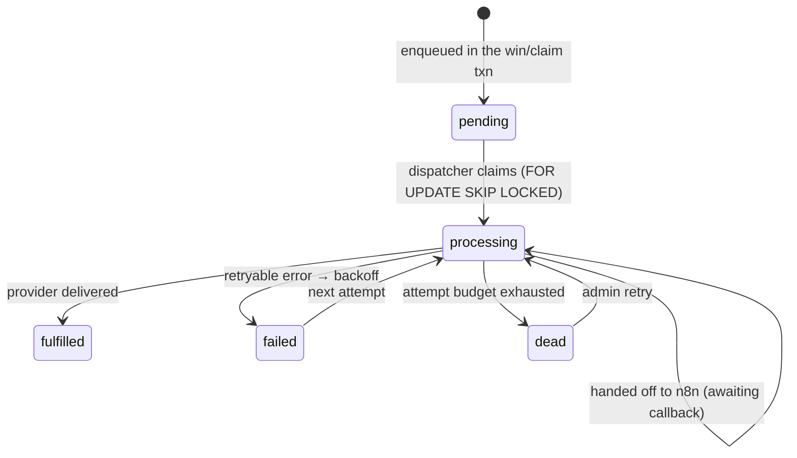
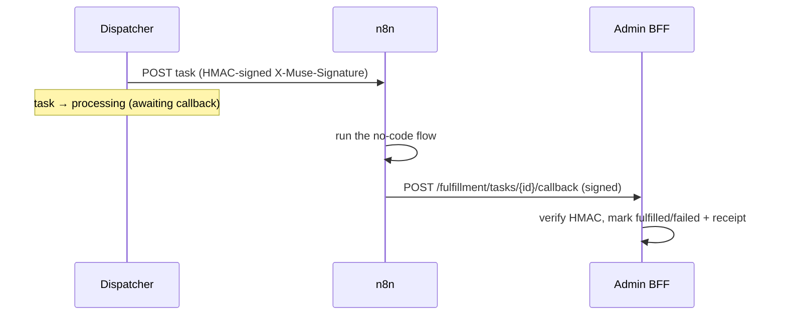

# Rewards & fulfillment

A **prize** is the catalog item (with stock + delivery policy). A **reward** is one awarded unit
with its own lifecycle. **Fulfillment** is how an owed reward is actually delivered.

## Prize → reward lifecycle



Prizes carry **constraints** (`max_per_user` / `max_per_day`, enforced inside the Play txn — a
capped prize the wheel lands on is dropped to no-win) and a **fulfillment** policy.

## Delivery is configured, not coded

> Principle: *our system is the source of truth for what is owed; an orchestrator owns how it is
> delivered.*

```jsonc
// prize.fulfillment
{ "redemption_mode": "on_claim",        // instant | on_claim | manual | exchange
  "channel": "external_workflow",        // voucher_code | sms | zns | email | points_credit |
                                         // physical_shipping | crm_sync | ecommerce | external_workflow
  "channel_config": { "webhook_url": "https://n8n…", "hmac_secret_ref": "secret://n8n" },
  "retry": { "max_attempts": 5, "backoff": "exponential" } }
```

A `FulfillmentProvider` registry maps each channel to an implementation (same pluggable pattern as
reward handlers). Built-in `voucher_code` pops a code from an imported pool; others are stubbed;
`external_workflow` hands off to **n8n**.

## The transactional outbox

Reliability comes from writing a `fulfillment_tasks` row **in the same DB transaction** as the
reward + stock deduction — so a delivery is never lost or duplicated.



A **dispatcher** worker polls due tasks (`SELECT … FOR UPDATE SKIP LOCKED`, multi-replica safe),
invokes the provider with exponential backoff, and dead-letters after the attempt budget. Completing
a task flips its reward to `fulfilled`.

## n8n via `external_workflow`



Our outbox tracks the lifecycle; n8n owns the steps. See the full sequence in
**[Flows → Rewards & fulfillment](../flows/rewards-fulfillment.md)**.

## Redemption modes

| Mode | When delivery happens |
|---|---|
| `instant` | automatically on win |
| `on_claim` | when the player calls claim |
| `manual` | staff approval queue |
| `exchange` | lucky-item milestone redeem (see [Wallet & milestones](wallet-milestones.md)) |
