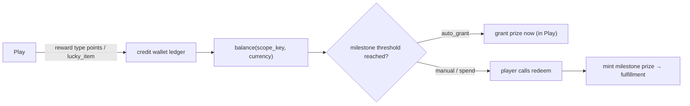
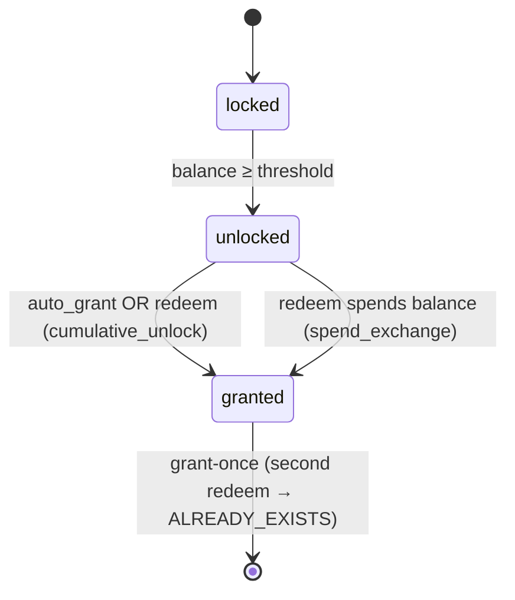

# Wallet, points & exchange

Some games award an intermediate **wallet currency** instead of (or alongside) a real prize. The
`lucky_item` handler credits a named item; any handler's `points` reward credits points. The engine
routes these to the **wallet ledger** inside the Play transaction — never stock-deducted, never
fulfilled — so balances **accumulate across plays**.

## Scope key

Balances are keyed by `(tenant_id, scope_key, currency)` where `scope_key` follows the game's
`wallet_scope`:

| `wallet_scope` | `scope_key` | Use case |
|---|---|---|
| `campaign` (default) | `campaign_id` | one-off event wallet |
| `merchant` | `merchant_id` | brand wallet across a merchant's campaigns |
| `tenant` | `tenant_id` | platform-wide loyalty |

## Milestones

Two modes convert accumulated balance into prizes:

- **`cumulative_unlock`** — reach the threshold → grant **once**. With `auto_grant`, the engine
  grants inside Play the moment the balance crosses; otherwise the player claims via `redeem`.
- **`spend_exchange`** — `redeem` **atomically spends** the threshold from the balance (a store).

Granting is **once-only** — a second `redeem` returns `ALREADY_EXISTS`. The milestone prize mints a
durable reward record (+ a fulfillment task when async), mirroring the engine's normal award path.

## Player surface

| Endpoint | Returns |
|---|---|
| `GET /api/v1/wallet?scope_key=…` | per-currency balances |
| `GET /api/v1/wallet/ledger?scope_key=…` | movements, newest-first |
| `GET /api/v1/games/{id}/milestones` | progress + per-rung status |
| `POST /api/v1/games/{id}/redeem` | claim / exchange a milestone |

See the step-by-step in **[Flows → Wallet redeem](../flows/wallet-redeem.md)**.
