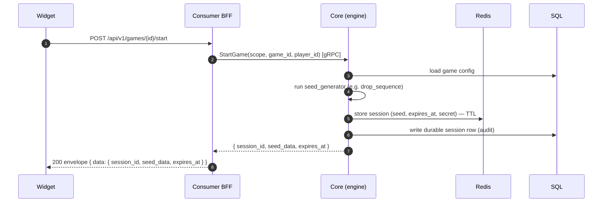
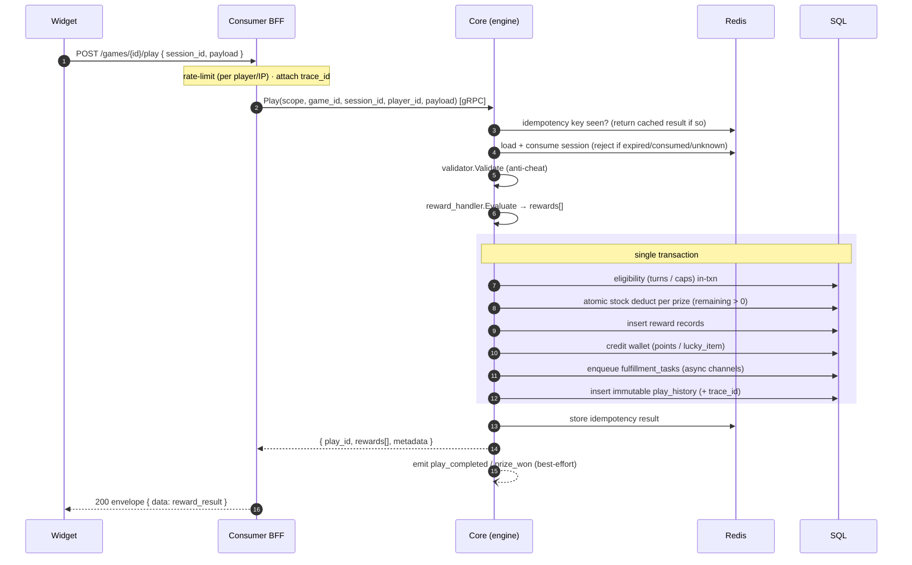

# Gameplay: `start` → `play`

The core loop. A player opens the widget, the server mints a session, the player acts, the server
decides the outcome and atomically commits it.

## Start

The `seed_data` is what the widget needs to render (e.g. the catch sequence for a gift-catcher).
For a spin wheel it's `null`.

## Play

### What can go wrong (and the error you get)

| Situation | `reason` |
|---|---|
| Session expired / already played | `SESSION_EXPIRED` / `SESSION_CONSUMED` |
| No turns left / outside window | `OUT_OF_TURNS` / `GAME_NOT_ACTIVE` |
| Prize stock exhausted | `PRIZE_OUT_OF_STOCK` |
| Anti-cheat rejected the payload | `CHEAT_DETECTED` |
| Too many requests | `RATE_LIMITED` (with `Retry-After`) |

See the full table in the [Error reference](../reference/errors.md).

## Why it's safe under load

Stock is a **conditional atomic update** (`remaining = remaining - 1 WHERE remaining > 0`) inside
the transaction — not a lock. N concurrent plays on a 1-unit prize yield exactly one winner; the
rest fall through to no-win. The idempotency key makes a retried winning `Play` return the same
result instead of double-awarding.
