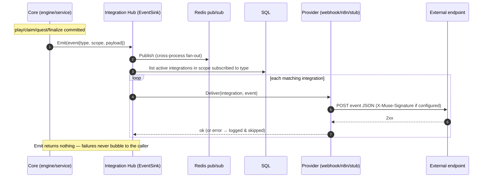
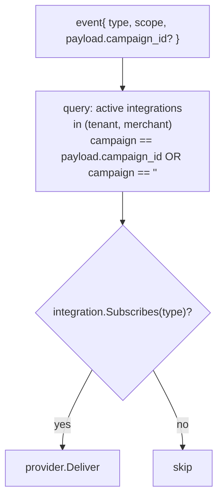
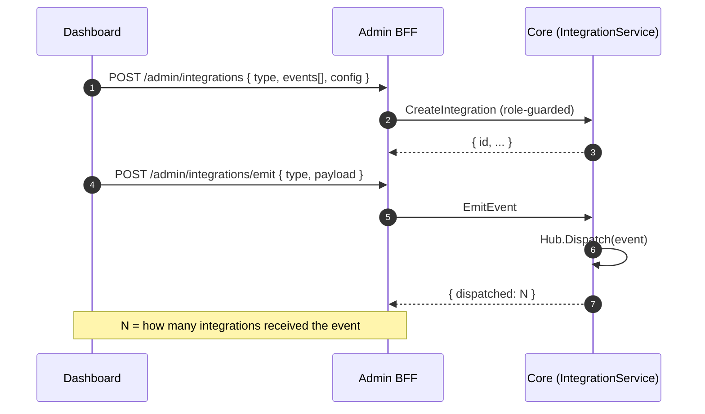

# Integration events: emit → fan-out → deliver

A domain event flows through the Hub to every subscribed integration, best-effort, without ever
affecting the operation that emitted it.

## End-to-end

## Subscription matching

An integration matches when it is **active**, in the event's tenant/merchant scope, subscribed to
the event type, and either scope-wide (`campaign_id == ""`) or narrowed to the event's campaign.

## Register + test

Proven by `make e2e-integration`: register an `sms` integration, emit `prize_won` → `dispatched: 1`;
emit an unsubscribed event → `dispatched: 0`; delete it → `dispatched: 0`.
