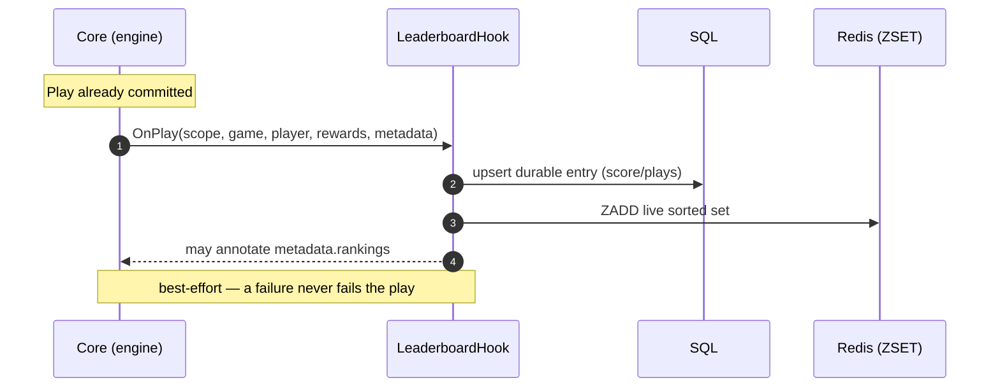
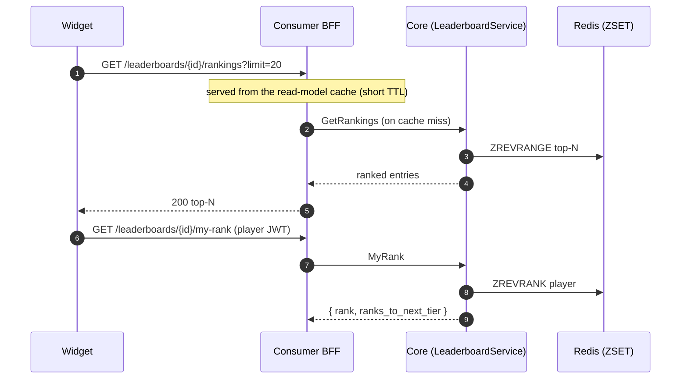
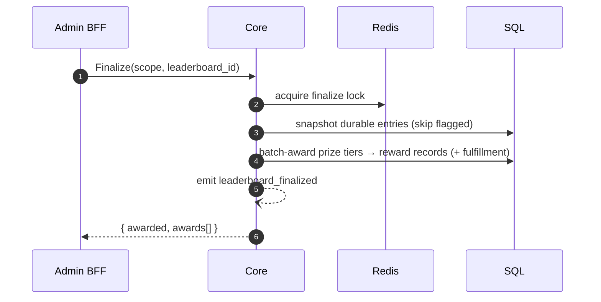

# Leaderboard: update → read → finalize

Every play folds into the active boards of its campaign; players read live ranks off Redis; an admin
finalizes to lock and batch-award prize tiers.

## Update (post-Play hook)

## Read (real-time)

## Finalize (admin)

Anti-cheat: outlier / velocity checks move suspicious entries to `flagged`; admins can
`disqualify` / `adjust`; **finalize only awards un-flagged ranks**.
