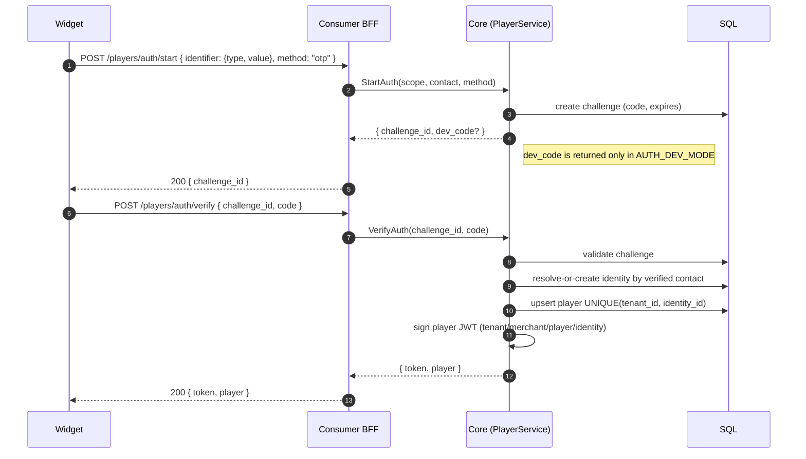
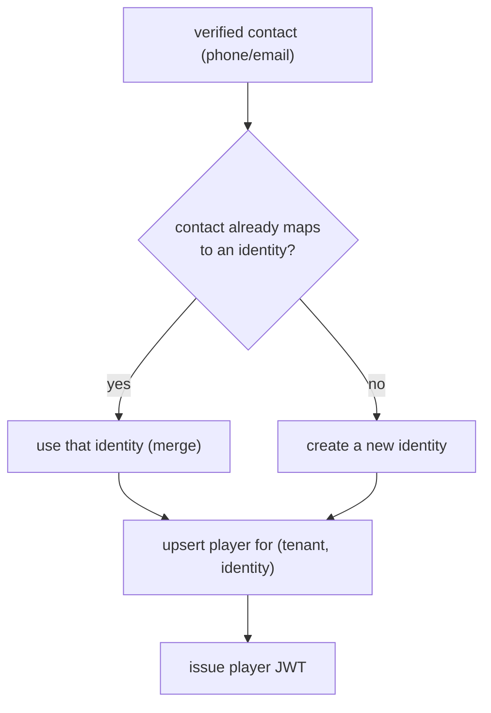
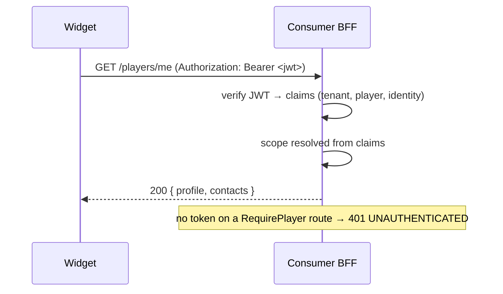

# Player auth: phone/email login

Login accepts **phone or email** via pluggable methods. Verification resolves-or-creates the global
identity, upserts the tenant player, and issues a player JWT. The same phone in two tenants → one
identity, two isolated players.

## Resolve-or-create & contact linking

## Using the token

The BFF auth seam verifies a `Bearer` token into request claims when present; routes that require a
player use `RequirePlayer`. For dev/e2e without a token, the `X-Tenant-Id` / `X-Player-Id` headers
are honored — handler code is identical.

Proven by `make e2e-identity`: the same phone in tenant A and tenant B yields **one** `identity_id`
but **different** `player_id`s, fully isolated.
