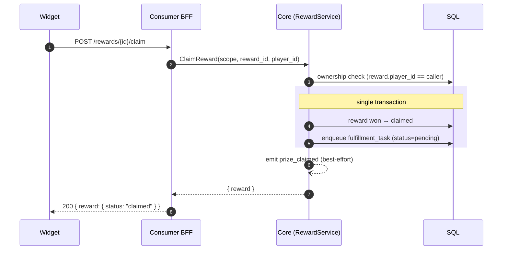
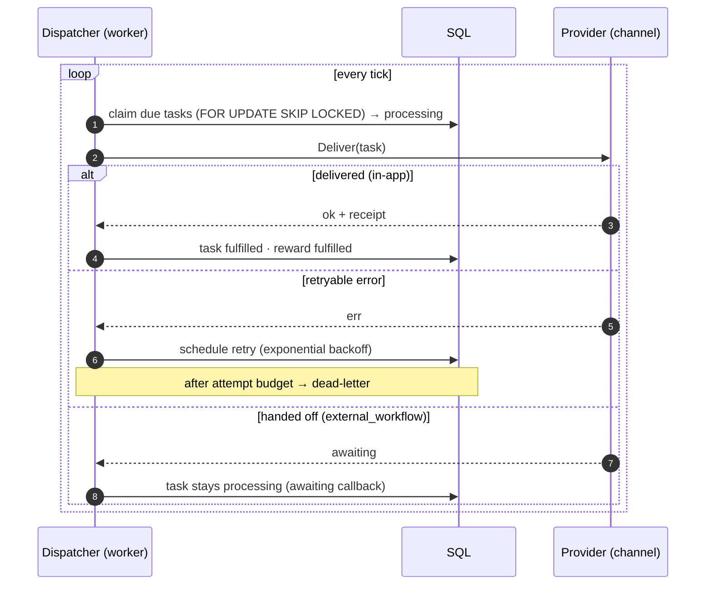
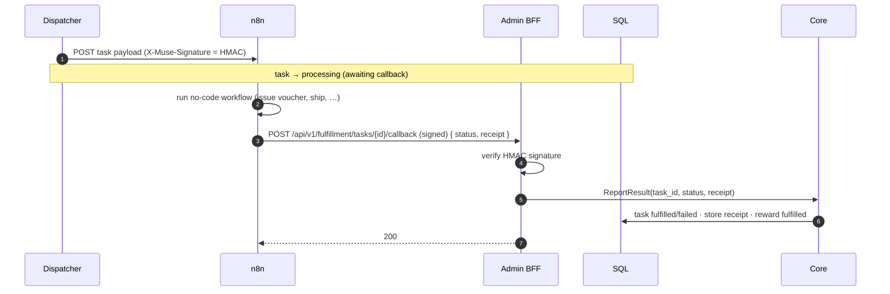

# Rewards & fulfillment

From winning a prize to delivering it — claim, the transactional outbox, the dispatcher, and the
signed n8n callback.

## Claim → outbox (on_claim mode)

For `instant` + in-app channels (`voucher_code`/none) the task is enqueued (or delivered) at **win**
time instead; the outbox row is always written in the same txn as the reward, so a delivery is never
lost or duplicated.

## Dispatcher drains the outbox

The dispatcher is multi-replica safe (`SKIP LOCKED`). Outcomes are also counted as the
`fulfillment_tasks_total{outcome}` metric (delivered/awaiting/retry/dead).

## n8n hand-off + signed callback

## Admin operations

| Endpoint | Purpose |
|---|---|
| `GET /api/v1/admin/fulfillment/tasks` | list (filter status / campaign / prize) |
| `POST /api/v1/admin/fulfillment/tasks/{id}/retry` | re-arm a failed/dead task |
| `POST /api/v1/admin/rewards/{id}/fulfill` · `/revoke` | manual lifecycle control |

Proven by `make e2e-fulfillment` (outbox + dispatcher + dead-letter/retry + HMAC callback).
