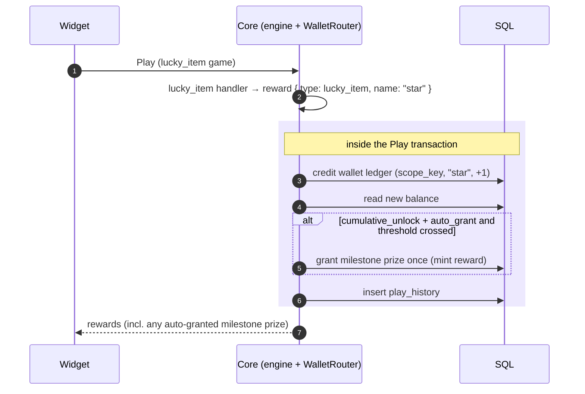
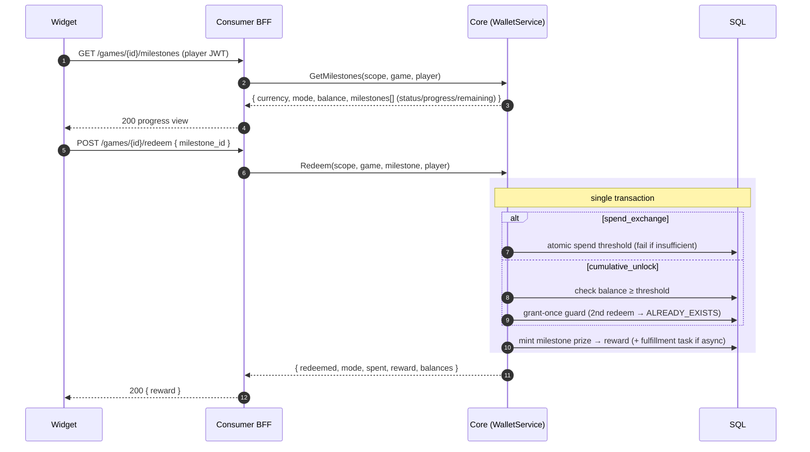
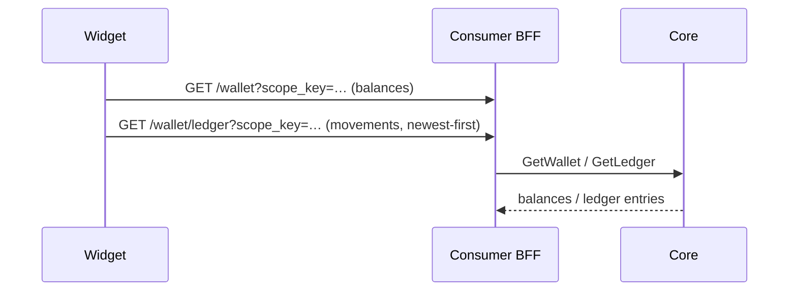

# Wallet: earn → milestone → redeem

A collection game credits a wallet currency on every play; once the balance reaches a milestone
threshold, the player redeems it for a real prize.

## Earning (inside Play)

## Redeeming (manual claim or spend-exchange)

## Reading the wallet

Proven by `make e2e-wallet`: two plays accrue 2 `lucky_star`, the milestone shows `unlocked`,
`redeem` grants the prize, and a second `redeem` returns `ALREADY_EXISTS`.
