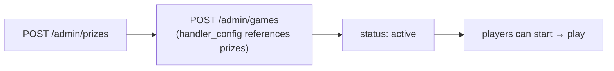

# Add a game — config only

A new game of an **existing shape** needs no backend code and no deploy. You create prizes, then a
game that references a registered `seed_generator` + `reward_handler` + `validator` and supplies a
`handler_config`.



## 1. Create prizes

```bash
A='-H Content-Type:application/json -H X-Tenant-Id:tenant_demo -H X-Merchant-Id:merchant_demo -H X-Roles:admin'

JACKPOT=$(curl -s $A -X POST localhost:8081/api/v1/admin/prizes \
  -d '{"name":"Voucher 100K","type":"voucher","value":100000,"stock":{"total":50}}' | jq -r .data.prize_id)
MISS=$(curl -s $A -X POST localhost:8081/api/v1/admin/prizes \
  -d '{"name":"Try again","type":"points","value":0,"stock":{"total":1000000}}' | jq -r .data.prize_id)
```

:::note Admin calls need a role
The admin surface is role-guarded. Send a real admin JWT, or the `X-Roles: admin` dev header.
:::

## 2. Create the game

A spin wheel = `none` seed + `probability` handler + `basic` validator:

```bash
curl -s $A -X POST localhost:8081/api/v1/admin/games -d "{
  \"name\": \"Vòng Quay May Mắn\",
  \"type\": \"spin_wheel\",
  \"campaign_id\": \"camp_demo\",
  \"seed_generator\": \"none\",
  \"reward_handler\": \"probability\",
  \"validator\": \"basic\",
  \"status\": \"active\",
  \"rules\": { \"max_plays_per_user\": 3, \"max_plays_per_day\": 1 },
  \"handler_config\": { \"prizes\": [
    { \"prize_id\": \"$JACKPOT\", \"probability\": 0.05 },
    { \"prize_id\": \"$MISS\",    \"probability\": 0.95 }
  ] },
  \"ui\": { \"theme\": { \"primary_color\": \"#FF5733\" }, \"custom_assets\": { \"wheel\": \"…\" } }
}" | jq .data
```

That's it — the game is live. `ui` is an **opaque blob**: Core stores and returns it; only the
widget reads it. A new visual is a widget change, never a Core change.

## handler_config by shape

```jsonc
// probability (spin / scratch)
{ "prizes": [ { "prize_id": "p1", "probability": 0.05 }, { "prize_id": "p0", "probability": 0.95 } ] }

// score_to_tier (egg-catcher)
{ "tiers": [ { "min": 0, "max": 29, "prize_group": "t0" }, { "min": 70, "max": 1000, "prize_group": "t2" } ],
  "prize_groups": { "t2": [ { "prize_id": "big", "probability": 1.0 } ] } }

// collect_items (gift-catcher) — also set seed_generator:"drop_sequence", validator:"drop_plan"
{ "drops": [ { "type": "voucher_50k", "prize_id": "p", "frequency": 4, "max_catchable": 2 } ],
  "total_items": 15, "interval_ms": 500 }

// lucky_item (collection) — pair with a milestones block (see Wallet)
{ "items": [ { "item": "lucky_star", "weight": 1, "quantity": 1, "slot_index": 0 } ] }
```

## Prize constraints & delivery

Each prize can carry caps and a delivery policy:

```jsonc
{ "name": "Voucher 100K", "type": "voucher", "value": 100000,
  "stock": { "total": 50 },
  "constraints": { "max_per_user": 1, "max_per_day": 1 },
  "fulfillment": { "redemption_mode": "on_claim", "channel": "voucher_code" } }
```

See [Rewards & fulfillment](../concepts/rewards-fulfillment.md) for channels and modes, and
[Wallet & milestones](../concepts/wallet-milestones.md) for `lucky_item` + `milestones`.

## When config isn't enough

If your mechanic doesn't fit any registered handler, you add one — see
**[Add a shape](add-a-shape.md)**. That's the only time gameplay needs code.
