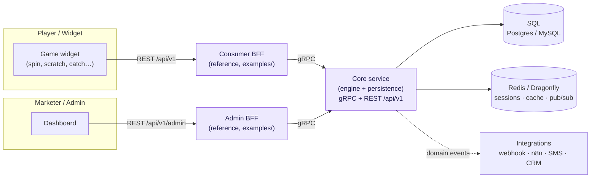
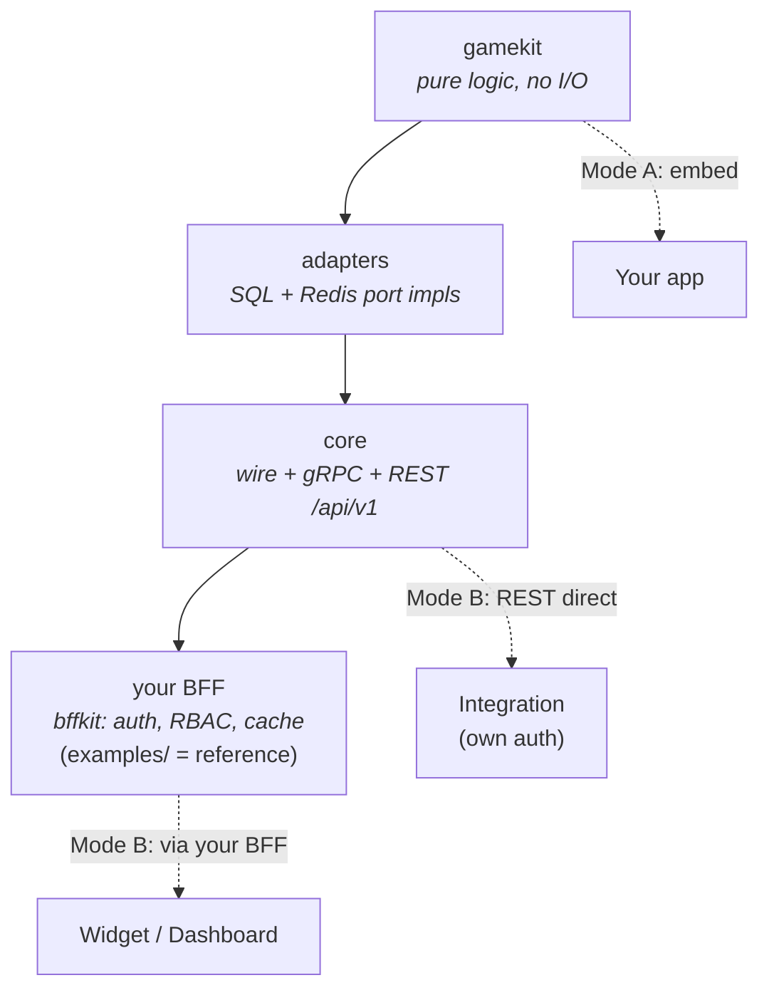

# What is Muse?

**Muse is a config-driven game backend** for marketing & gamification — spin wheels, scratch
cards, egg/gift catchers, collection games, quizzes — sitting inside a website-builder platform.

Its one defining idea:

> **Adding a new game must not require new backend code.**
>
> A new game of an existing *shape* = a **JSON config**. A genuinely new *shape* = one small
> handler/validator. The engine core never changes.

## The big picture

A marketer configures a campaign + game in the dashboard; a player opens the widget and plays;
the Core engine decides the outcome (server-authoritative), deducts stock atomically, records the
result, and fans events out to integrations.

## Two ways to use it

Muse ships the engine as a **pure Go SDK** (`gamekit`) and also as a **hosted API**:

| Mode | You write | You get |
|---|---|---|
| **A — embed the SDK** | `import ".../gamekit"`, implement a few port interfaces (or use the provided `adapters`), call `engine.Play(...)` | The game logic only — bring your own DB/auth/transport |
| **B — run the hosted API** | deploy `core`; front it with your own BFF for auth/edge (or copy `examples/`) | Full gRPC **+ REST** API, multi-tenant, batteries included |

The boundary is strict: **`gamekit` knows nothing about gRPC, HTTP, the JSON envelope, or
snake_case** — those live only in Core (its REST gateway) and your BFF. Core is **auth-agnostic**:
it trusts the caller to authenticate and pass the tenant/merchant scope. That is what makes "use my
logic, build your own API" — and "use my API, build your own edge" — first-class paths.

## Where to go next

- **[Architecture → Overview](architecture/overview.md)** — the modules and how they fit.
- **[Flows → Gameplay](flows/gameplay.md)** — what actually happens on `start` → `play`.
- **[Guides → Quickstart](guides/quickstart.md)** — run the whole stack and play a game in minutes.
- **[Guides → Add a game](guides/add-a-game.md)** — ship a new game with config only.

:::tip For end users
If you just want to **launch a game**, read [Quickstart](guides/quickstart.md) then
[Add a game](guides/add-a-game.md). If you want to **understand how it works**, start with
[Architecture](architecture/overview.md) and the [Flows](flows/gameplay.md).
:::
