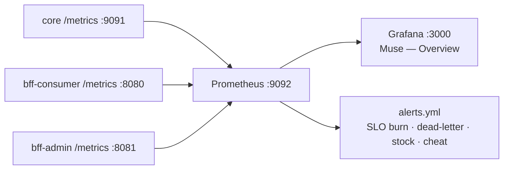

# Observability

Every service exposes Prometheus metrics; Prometheus scrapes them; Grafana renders a provisioned
dashboard with alert rules. All wiring is in `deploy/`.



## Metrics

### Core (`:9091/metrics`)

| Metric | Labels | Source |
|---|---|---|
| `grpc_server_requests_total` | `method`, `code` | gRPC RED interceptor |
| `grpc_server_request_duration_seconds` | `method` | gRPC RED interceptor |
| `game_events_total` | `type` | domain events via `metricsSink` (play/win/claim/quest/finalize) |
| `fulfillment_tasks_total` | `outcome` | dispatcher (delivered/awaiting/retry/dead) |

The `game_events_total{type}` series **is** the gameplay funnel — `play_completed` → `prize_won` →
`prize_claimed`.

### BFFs (`:8080` / `:8081` `/metrics`)

| Metric | Labels | Notes |
|---|---|---|
| `http_requests_total` | `route`, `method`, `code` | `route` is the **matched chi pattern** (bounded cardinality); 429s and 5xx land here |
| `http_request_duration_seconds` | `route`, `method` | RED latency |
| `bff_cache_ops_total` | `result` | read-model cache `hit` / `miss` |

## Dashboard

Grafana → **Muse — Overview** (`deploy/grafana/dashboards/muse-overview.json`), auto-provisioned:

- **gRPC** — request rate by method, error ratio, p99 latency.
- **HTTP** — request rate by service, status mix, p99 latency.
- **Business** — gameplay funnel, fulfillment outcomes, cache hit ratio.

## Alerts (`deploy/alerts.yml`)

| Alert | Fires when |
|---|---|
| `CoreGRPCErrorRateHigh` | non-OK gRPC ratio > 5% (10m) |
| `BFFHTTPErrorRateHigh` | 5xx ratio > 5% per service (10m) |
| `BFFLatencyP99High` | HTTP p99 > 1s (10m) |
| `FulfillmentDeadLetterGrowth` | any task hits dead-letter (10m) |
| `FulfillmentRetryStorm` | sustained delivery retries |
| `PrizeOutOfStockSpike` | `Play` returning `Aborted` (out of stock) |
| `PlayRejectionSpike` | `Play` returning `InvalidArgument` (validation / anti-cheat) |

## Trace correlation

The `trace_id` in every response envelope (and the `X-Trace-Id` header) is propagated BFF → Core via
gRPC metadata and stamped onto immutable `play_history`. A client-side error id maps straight to a
server log line.

:::note Distributed tracing
OTLP tracing to Tempo/Loki is a planned addition; metrics, dashboards, and trace-id correlation are
in place today.
:::

## Generate traffic

```bash
make seed   # creates a game + plays once
make e2e    # full spin-wheel flow
```

Then watch the panels in Grafana move.
