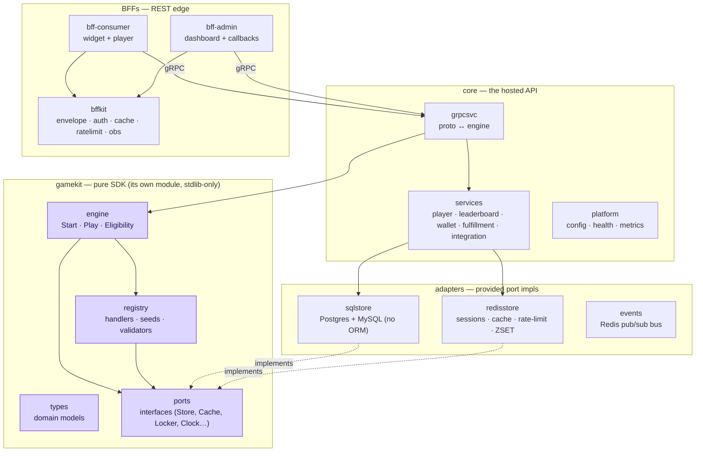
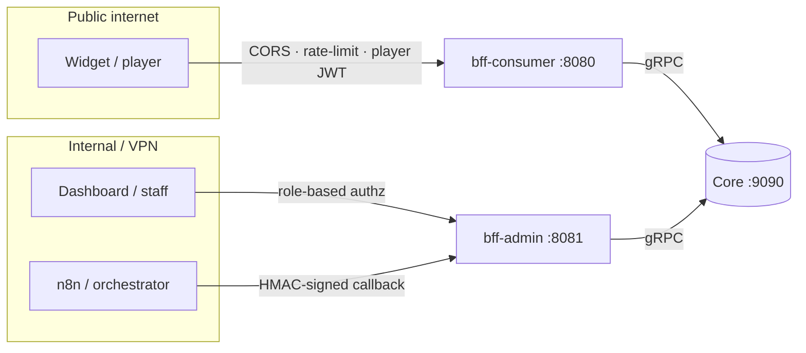
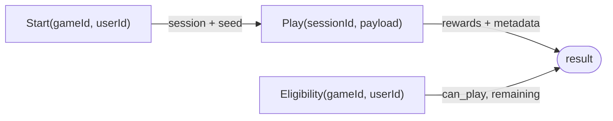

# Architecture overview

Muse is a Go monorepo (`go.work`) with a strict, one-directional dependency flow. Each layer only
knows about the layer beneath it.



## The layers

| Layer | Module(s) | Responsibility | Knows about… |
|---|---|---|---|
| **Pure SDK** | `gamekit` | Domain models + the generic engine + the handler/seed/validator registry. **No I/O.** | nothing but Go stdlib |
| **Adapters** | `adapters/sqlstore`, `adapters/redisstore`, `adapters/events` | Concrete implementations of the SDK's `ports` over SQL / Redis. | `gamekit/ports` |
| **Core** | `core` | One *composition*: wires `gamekit` + `adapters` and exposes the gRPC contracts; hosts the services that need I/O (player auth, leaderboard, wallet, fulfillment, integration hub). | gamekit + adapters + proto |
| **BFF** | `bffkit`, `bff-consumer`, `bff-admin` | The REST edge: the uniform JSON envelope, snake_case, auth, caching, rate-limit, metrics. | proto (via a gRPC client) |

## Responsibility boundary: Core = business, BFF = presentation

This split is deliberate and load-bearing:

- **Core owns business objects & rules only.** It returns whole domain entities and business
  errors. It does **not** know about the response envelope, snake_case, HTTP status, pagination
  cursors, localization, or the widget's look. The `ui` block on a game is an **opaque JSON blob**
  Core stores and returns but never interprets.
- **BFF owns everything UI-facing.** It aggregates multiple Core RPCs into one view model, shapes
  & redacts per audience (a public prize list strips `probability`/`stock`), applies the envelope,
  caches hot reads, and maps gRPC status → HTTP.

> **Consequence:** a new UI requirement is a BFF/widget change, not a Core change — reinforcing the
> config-driven goal.

## Why two BFFs?



Splitting by audience lets each scale and be secured independently — the admin surface never sits
on the public edge. Both import the shared **`bffkit`** so behavior (envelope, auth seam, error
mapping) stays consistent.

## The uniform response envelope

Every REST response — success or error — has the same shape:

```jsonc
{ "code": 0,            // canonical google.rpc.Code; 0 = OK
  "message": "ok",
  "trace_id": "01H…",   // also echoed in X-Trace-Id
  "data": { /* payload on success; null on error */ } }
```

Errors carry a stable machine-readable `reason` in `data.error` — see the
[Error reference](../reference/errors.md).

## The uniform engine API

Everything a game does goes through three operations, regardless of shape:



See **[Concepts → Generic engine](../concepts/generic-engine.md)** for how config selects the
behavior, and **[Flows → Gameplay](../flows/gameplay.md)** for the step-by-step sequence.
